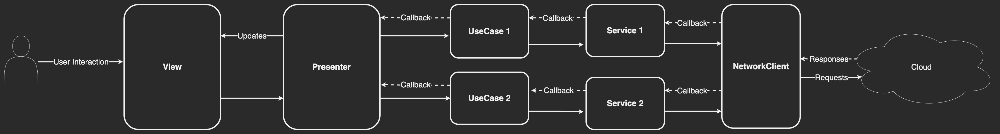

# The MovieDB

<video src='https://user-images.githubusercontent.com/48848704/197476779-77e2bf7e-9f2f-458c-b331-5b833876df29.mp4' width=300></video>

---

## Requirements:
### Functional:
- Fetching and parsing data from API.
- Listing Data.
- Searching.
- Pagination.
- Navigation to Details view.

### Non-Functional:
- Performance:
  - Caching images.

- Scalability:
  - Modularity.
  
- Reliability:
  - Unit tests.

## Low-Level Design

---
### Design Decisions
- UI:
  - UIKit
  - MVP Architecture

- Principals and Patterns:
  - SOLID conformance:
    - Features are separated into modules.
    - UseCases for business logic.
  - Utilizing IoC and DI.
  - Coordinator pattern for navigation.

- Dependency Manager:
  - Swift Package Manager (SPM)

- Dependencies:
  - [Kingfisher](https://github.com/onevcat/Kingfisher): Downloading and caching images from the web.

---

### Notes:
* Design Patterns:
    * [Bridge Design Pattern](https://refactoring.guru/design-patterns/bridge) (`BaseVC` and `BasePresenter`) is used to avoid code duplication.
    * [Adapter Design Pattern](https://refactoring.guru/design-patterns/adapter) (`HTTPClient` and `WatchlistDataStore`) is used to easily swap HTTP clients or Data Persistence if needed (ex. `Alamofire` instead of `URLSession`).
    * [Composite Reuse Principle (CRP)](https://en.wikipedia.org/wiki/Composition_over_inheritance) (`DataSources` and `Delegates`) is used to compose the `ViewControllers`.
    * An Automatic DI Container ([Resolver](https://github.com/hmlongco/Resolver) or [Swinject](https://github.com/Swinject/Swinject)) could be used if the project got bigger.
    * Repository Pattern could be used if local data storage is needed in the future.
* iOS APIs:
    * [DispatchGroup](https://developer.apple.com/documentation/dispatch/dispatchgroup) (`SimilarMoviesUseCase`) is used to handle multiple async network calls.
    * Race Conditions are avoided in `SimilarMoviesUseCase` using a serial `DispatchQueue`.
    * A [Set](https://developer.apple.com/documentation/swift/set/contains(_:)) is used over an [Array](https://developer.apple.com/documentation/swift/array/contains(_:)) in `WatchlistDataStore` to achieve `O(1)` search time complexity.
* To achieve better UX:
    * `ActivityIndicator` for each network called is used.
    * `Debouncer` is used to avoid unneeded search results and UI refreshes.
    * DarkMode and Landscape modes are supported.
    * Errors are handled to avoid failing silently.
    * Different placeholders are used for different image types (poster or cast).
* All the presenters are unit tested (15 tests in total).
